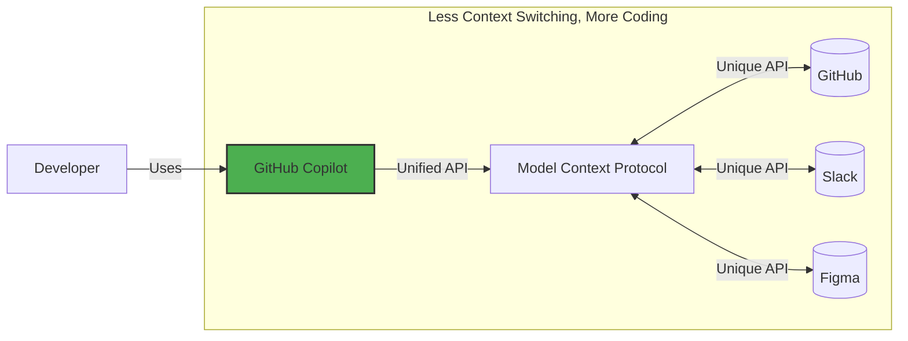

## Step 1: Introduction to MCP and environment setup

In this exercise, you'll learn how to use Model Context Protocol (MCP) to connect GitHub Copilot to your entire toolchain.
This integration allows you to solve problems across platforms without leaving your code editor. **Less context switching, more coding**.

> [!IMPORTANT]
> This exercise may not explain the Copilot basics that were introduced in the [Getting Started with Copilot](https://github.com/skills/getting-started-with-github-copilot) exercise. If you are new to Copilot we recommend starting with that one.

### What is Model Context Protocol (MCP)?

[Model Context Protocol (MCP)](https://modelcontextprotocol.io/introduction) is often referred to as "USB-C for AI" - a universal connector that allows GitHub Copilot to seamlessly interact with external tooling.


### :keyboard: Activity: Get to know your environment

Let's start up our development environment and familiarize with the environment.

We are using the same web application as in the [Getting Started with Copilot](https://github.com/skills/getting-started-with-github-copilot) exercise - the Mergington High School's extracurricular activities website.

1. Right-click the below button to open the **Create Codespace** page in a new tab. Use the default configuration.

   [](https://codespaces.new/{{full_repo_name}}?quickstart=1)

1. Validate the Copilot Chat extension is installed
1. In the left sidebar, select the `Run and Debug` tab and then press the **Start Debugging** icon.

   

1. Throughout the exercise, you can access the website link from the `ports` tab on port `8000`.

### :keyboard: Activity: Set up a MCP server for your project

1. Inside your codespace, create a new file named `mcp.json` in the `.vscode` directory and paste the following contents:

```json
// .vscode/mcp.json
{
  "servers": {
    "github": {
      "command": "npx",
      "args": ["-y", "@modelcontextprotocol/server-github"],
      "env": {
        "GITHUB_PERSONAL_ACCESS_TOKEN": "${input:githubToken}"
      }
    }
  },
  "inputs": [
    {
      "type": "promptString",
      "id": "githubToken",
      "description": "Enter your GitHub personal access token",
      "password": true
    }
  ]
}
```

1. Save the file and you should see `Start` button show up like so:

   

1. When you start the server, you will be prompted to provide a GitHub Token. You can use the token provided to you by the GitHub Codespace you are working in.

   ```bash
      echo $GITHUB_TOKEN
   ```

1. Validate the server is running.

   1. The `.vscode/mcp.json` file should show if the server you started is running

      <details>
      <summary>:camera_flash: See screenshot</summary><br/>

      

      </details>

   1. You should see additional tools available in Copilot Agent Mode

      <details>
      <summary>:camera_flash: See screenshot</summary><br/>

      

      </details>

   1. You can use the VSCode command palette `Ctrl+Shift+P` or `Command+Shift+P` on Mac.
      Start typing `> MCP` to see different MCP commands, such as listing active servers.

         <details>
         <summary>:camera_flash: See screenshot</summary><br/>

      

         </details>

1. Commit and push the `.vscode/mcp.json` file to the `main` branch

<details>
<summary>Having trouble?</summary><br/>

Make sure you:

- Properly copied the `json` contents above to `.vscode/mcp.json` file
- Pushed your changes to the `main` branch

</details>
